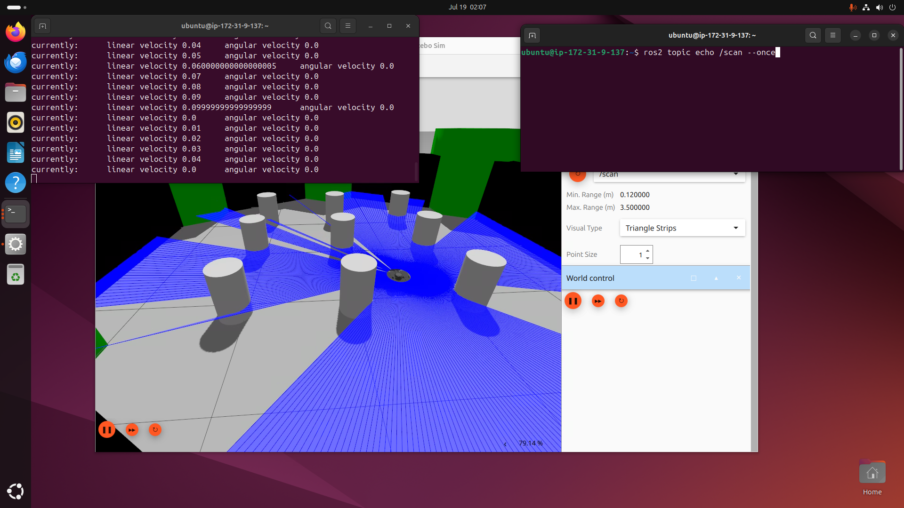

# ROS2 Robotics EC2 — Terraform Setup

Provisions a GPU EC2 instance (`g4dn.xlarge`) on Ubuntu with a desktop
environment, NICE DCV remote desktop, and ROS2 Jazzy pre-installed via
`user_data`. Managed entirely with Terraform — create, update, and destroy
through the CLI, no manual console clicking.





---

## Folder structure

```
terraform-ec2/
├── .gitignore
├── provider.tf                 # AWS provider config
├── variables.tf                # input variables + defaults
├── main.tf                     # security group + EC2 instance
├── outputs.tf                  # instance id, IP, DCV URL
├── terraform.tfvars            # actual values used for this deployment
└── scripts/
    ├── bootstrap.sh.tftpl      # cloud-init entrypoint (runs once, first boot)
    └── provision.sh.tftpl      # phased install script (survives the reboot)
```

Generated locally by Terraform, not committed to git (see `.gitignore`):

```
.terraform/                     # downloaded provider plugins
.terraform.lock.hcl             # provider version lock
terraform.tfstate               # current real-world state — never hand-edit
terraform.tfstate.backup        # previous state, auto-saved
```

---

## One-time local setup

1. **Install Terraform CLI**
   - macOS: 
    - `brew tap hashicorp/tap`
    - `brew install hashicorp/tap/terraform`
   - Verify: `terraform -version`

2. **Install AWS CLI**
   - macOS: 
    - `brew install awscli`
   - Verify: `aws --version`

3. **Create a root access key** (AWS Console → account name top-right →
   Security credentials → Access keys → Create access key)
   - This project uses root credentials rather than a dedicated IAM
     user — a deliberate choice for solo/personal use. See the
     **Security note** below before relying on this long-term.
   - If "Create access key" isn't available, root keys have been
     disabled at the account level (default for newer accounts) — you
     have to explicitly re-enable it under account settings.
   - Copy the Access Key ID and Secret Access Key immediately — the
     secret is only shown once.

4. **Configure credentials**
   ```bash
   aws configure
   ```
   Enter Access Key ID, Secret Access Key, region (`ap-southeast-2`),
   output format (`json`). Terraform's AWS provider reads these
   automatically — nothing to configure in the `.tf` files.

   > **Security note — using root credentials:** Root has unrestricted
   > access to the whole AWS account (billing, IAM, ability to delete
   > everything), with no permission boundary above it. AWS's own
   > guidance is to avoid root for everyday use. For this solo project
   > it's a reasonable tradeoff, but:
   > - Enable **MFA on the root account** regardless.
   > - Consider **deleting the access key when not actively using it**
   >   (Security credentials → Access keys → Deactivate/Delete) and
   >   regenerating when needed, rather than leaving a long-lived root
   >   key on disk.
   > - Never commit `~/.aws/credentials` anywhere — Terraform never
   >   asks for or stores credentials in the `.tf` files, so this risk
   >   is contained to your local machine only.
   > - If this ever becomes a shared or longer-lived project, switch to
   >   an IAM user with a scoped policy (e.g. `AmazonEC2FullAccess`)
   >   instead.

5. *(Optional)* VS Code + HashiCorp Terraform extension for syntax
   highlighting, `terraform fmt`, and inline validation.

---

## Day-to-day workflow

| Step | Command | What it does |
|---|---|---|
| 1. Initialize | `terraform init` | Downloads the AWS provider plugin. Run once per machine/clone, or after adding a new provider. |
| 2. Preview | `terraform plan` | Shows what will be created/changed/destroyed. Nothing happens yet — always check this before applying. |
| 3. Apply | `terraform apply` | Creates/updates real AWS resources. Prompts for confirmation (`yes`). |
| 4. Inspect | `terraform output` | Prints `instance_id`, `public_ip`, `dcv_url`. |
| 5. Tear down | `terraform destroy` | Deletes everything Terraform is tracking (instance + security group). Prompts for confirmation. |

**Making changes:** edit the `.tf` files or `terraform.tfvars`, then repeat
steps 2–3. Terraform diffs against state and only touches what changed.

**State file (`terraform.tfstate`):** this is Terraform's memory of what
it created. Keep it — losing it means Terraform "forgets" the resources
exist (they'll keep running in AWS, but you'd have to `terraform import`
them back in to manage them again). Solo/local state is fine for this
project; no remote backend needed.

---

## How the reboot is handled

The install has a mid-script `reboot` (to load the NVIDIA config /
desktop environment). Since `user_data` normally only runs once on
first boot, `bootstrap.sh.tftpl` sets up a **systemd service**
(`provision.service`) that re-runs `provision.sh` on every boot.
`provision.sh` tracks its progress in `/var/lib/provision-phase`:

- **Phase 1** — desktop environment, NVIDIA config, DCV server install →
  writes `2` to the phase file → reboots.
- **Phase 2** (runs automatically after reboot via systemd) — DCV
  config, ROS2 Jazzy install, workspace setup → writes `done` → disables
  `provision.service` so it never runs again on future stop/starts.

Progress and errors are logged to `/var/log/provision.log` on the
instance.

---

## Accessing the instance

- **NICE DCV (remote desktop):** `https://<public_ip>:8443`
  Login: `ubuntu` / `ubuntu` (set by the provisioning script — change
  this if the instance will be reachable long-term).
- **SSH (port 22):** open in the security group, but no key pair is
  attached and password SSH auth isn't enabled by default. Use DCV, or
  add a key pair / enable password auth / attach an SSM role if you
  need SSH or CLI access.

---

## GitHub access (deploy key)

Each instance generates its own SSH key during provisioning (Phase 2)
rather than reusing your laptop's personal GitHub key — if the
instance is ever compromised or torn down, you just revoke this one
key on GitHub instead of your main identity.

**Retrieving the public key after `apply`:**
- Open a terminal in the DCV desktop session and run:
  ```bash
  cat ~/github_deploy_key.pub
  ```
- Or check `/var/log/provision.log` — it's printed clearly between
  `====` banners near the end of the Phase 2 output.

**Adding it to GitHub (per repo):**
1. Go to the repo → **Settings → Deploy keys → Add deploy key**.
2. Paste the public key.
3. Check **"Allow write access"** only if you need to `push`, not just
   `pull`.

**Test from the instance:**
```bash
ssh -T git@github.com
```

Because this key is generated fresh every time the instance is
rebuilt, you'll need to re-add it as a deploy key after each full
`destroy` → `apply` cycle (not needed for plain reboots/updates —
the key persists on the EBS volume as long as the instance itself
isn't destroyed).

---
 
## How long until the instance is actually ready
 
**`public_ip` being displayed is fast (~1-2 min) but misleading.**
`terraform apply` returns as soon as AWS reports the instance
`running` with a public IP assigned — that's a networking-layer check
only. It says nothing about what's happening inside the OS, which is
still mid-provisioning at that point.
 
**Actual readiness takes ~15-25+ minutes**, broken down roughly as:
 
| Stage | Rough time |
|---|---|
| Instance boots, cloud-init starts | ~1-2 min |
| Phase 1: `apt update/upgrade`, desktop install, NVIDIA config, DCV install | ~5-10 min |
| **Reboot** (Phase 1 → Phase 2 handoff) | ~1-2 min |
| Phase 2: DCV config, full ROS2 Jazzy + package set install, workspace setup, SSH key gen | ~10-15 min |
 
**Don't try connecting via DCV right after `apply` returns** — the
`dcvserver` isn't running yet, so the connection will just fail. Wait
~15-25 minutes, then try the URL/app. If it's not up yet, wait a bit
longer and retry — there's no harm in retrying, the connection simply
refuses until Phase 2 finishes and `dcvserver` starts.
 
There's no SSH/SSM access configured to poll `/var/log/provision.log`
remotely for exact status — for a solo dev box, "wait ~20 min, then
try connecting, retry if needed" is the simplest approach.


---
 
## Connecting via NICE DCV
 
Get the instance's current public IP first:
```bash
terraform output public_ip
# or
terraform output dcv_url
```
 
> **Note:** the public IP changes on every stop/start (or
> destroy/apply) cycle since this setup uses the default auto-assigned
> IP, not an Elastic IP. Re-check the output each time before
> connecting — don't bookmark a fixed address.
 
**Login for both methods:** `ubuntu` / `ubuntu` (set by the
provisioning script — change this if the instance is ever exposed
long-term).
 
### Option A — Browser
 
1. Go to `https://<public_ip>:8443`
2. You'll hit a **certificate warning** — this is expected. DCV ships
   with a self-signed cert by default. Click **Advanced → Proceed
   anyway** (or your browser's equivalent).
3. Log in as `ubuntu`.
### Option B — DCV Viewer app
 
Download from [amazondcv.com](https://www.amazondcv.com/).
 
1. Open the app.
2. Enter `<public_ip>:8443` (include the port).
3. Accept the same self-signed certificate trust prompt on first
   connect — the app remembers it after that.
4. Log in as `ubuntu`.
Both work without extra config because of two settings already in
`dcv.conf`:
- `create-session = true` — lets DCV auto-create a session on
  connect, instead of requiring one to be pre-created via CLI first.
- `owner = "ubuntu"` — ties that auto-created session to the `ubuntu`
  user.

---
 
## Spot instances (optional, cheaper)
 
`g4dn.xlarge` spot pricing is typically **50-70% cheaper** than
on-demand. Supported via a toggle in `terraform.tfvars`:
 
```hcl
use_spot_instance = true
spot_max_price    = "0.25"   # your max hourly bid in USD; omit to default to on-demand price as cap
```
 
Then `terraform apply` as usual — same instance, same provisioning,
just billed as spot.
 
**Tradeoff to know before enabling:** AWS can interrupt a spot
instance with as little as ~2 minutes' notice if it reclaims capacity
or the price rises above your bid. Given this box takes ~20 minutes to
provision and is used as an interactive desktop (DCV session), an
interruption mid-work is more disruptive here than for a typical
background/batch job.
 
To keep this predictable, this config uses:
- `spot_instance_type = "one-time"` + `instance_interruption_behavior =
  "terminate"` — on interruption, the instance is terminated outright
  (matches on-demand's usual lifecycle — no lingering stopped
  instance, no surprise storage charges from a stopped-but-not-deleted
  box).
- **Full re-provisioning on next `apply`.** Since termination deletes
  the EBS root volume, a fresh instance means Phase 1 → reboot →
  Phase 2 runs again from scratch (~20 min), and a new GitHub deploy
  key gets generated (re-add it to the repo's deploy keys).
**Spot request lifecycle / does Terraform cancel it?**
Yes — with `spot_instance_type = "one-time"`, AWS itself automatically
closes the spot request the moment the instance is fulfilled and later
terminated (whether terminated by an interruption, or by you running
`terraform destroy`). There's no separate spot request object for
Terraform to track or clean up — `instance_market_options` is just a
launch-time attribute of the `aws_instance` resource, not a distinct
resource type. `terraform destroy` terminates the instance exactly
like it would an on-demand one, and the one-time spot request closes
itself as a side effect. Nothing lingers, nothing to check manually.
 
What you *do* lose on interruption: your active DCV session, unsaved
in-memory work, and the provisioned environment itself (since it's not
preserved). Save work periodically if running on spot, and expect to
re-provision if interrupted.
 
**Switching between spot and on-demand:**
```hcl
# terraform.tfvars
use_spot_instance = true    # or false
spot_max_price    = "0.25"  # ignored when use_spot_instance = false
```
then `terraform plan && terraform apply`.
 
`instance_market_options` is a launch-time attribute — it can't be
changed on a running instance, so toggling this always shows as
`-/+ aws_instance.ros2_robotics (destroy and then create)` in the
plan, never an in-place update. Practically this means switching
either direction = full re-provisioning (~20 min), a new public IP,
and a new GitHub deploy key to re-add — same cost as a manual
`destroy` + `apply`. The security group is untouched either way.
 
Switch back to on-demand any time by setting `use_spot_instance =
false` (or removing the line) and re-applying — Terraform will
recreate the instance under the new pricing model since
`instance_market_options` forces a replacement.

---

## Things to check/update before applying

- [ ] `allowed_cidr` in `terraform.tfvars` — defaults to `0.0.0.0/0`
      (open to the internet on ports 22 and 8443). Narrow to your own
      IP (`x.x.x.x/32`) if this will be up for more than a quick test.
- [ ] Confirm the AMI (`ami_id`) still exists in your target region —
      AMI IDs can be deprecated/replaced over time.
- [ ] `g4dn.xlarge` is a paid GPU instance — remember to
      `terraform destroy` (or at least stop the instance) when not in
      use. Provisioning alone takes ~15–25 minutes before ROS2 is fully
      installed.

---

## Useful commands

```bash
terraform fmt              # auto-format .tf files
terraform validate         # check syntax without hitting AWS
terraform show             # dump current state in human-readable form
terraform state list       # list resources Terraform is tracking
terraform destroy -target=aws_instance.ros2_robotics   # destroy just one resource
```
