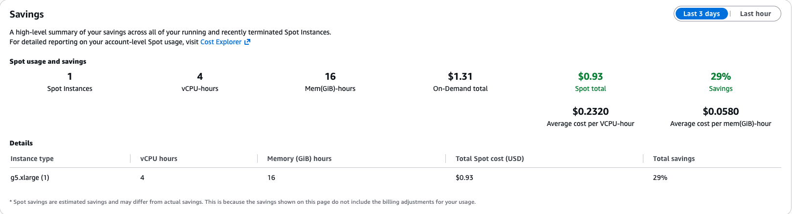
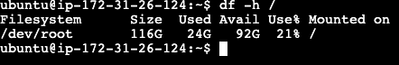

# ROS2 Robotics EC2 — Terraform Setup

Provisions a GPU EC2 instance (`g4dn.xlarge`) on Ubuntu with a desktop
environment, NICE DCV remote desktop, and ROS2 Jazzy pre-installed via
`user_data`. Managed entirely with Terraform — create, update, and destroy
through the CLI, no manual console clicking.





---

## Folder structure

```
terraform-ec2/
├── .gitignore
├── provider.tf
├── variables.tf
├── main.tf
├── data.tf                     # account/VPC/subnet lookups (used by Spot Fleet mode)
├── outputs.tf
├── terraform.tfvars
└── scripts/
    ├── bootstrap.sh.tftpl      # cloud-init entrypoint (runs once, first boot)
    └── provision.sh.tftpl      # phased install script (survives the reboot)
```

Generated locally by Terraform, not committed to git (see `.gitignore`):

```
.terraform/                     # downloaded provider plugins
.terraform.lock.hcl             # provider version lock
terraform.tfstate               # current real-world state — never hand-edit
terraform.tfstate.backup        # previous state, auto-saved
```

---

## One-time local setup

1. **Install Terraform CLI**
   - macOS: 
    - `brew tap hashicorp/tap`
    - `brew install hashicorp/tap/terraform`
   - Verify: `terraform -version`

2. **Install AWS CLI**
    - macOS: 
    - `brew install awscli`
   - Verify: `aws --version`

3. **Create a root access key** (AWS Console → account name top-right →
   Security credentials → Access keys → Create access key)
   - This project uses root credentials rather than a dedicated IAM
     user — a deliberate choice for solo/personal use. See the
     **Security note** below before relying on this long-term.
   - Copy the Access Key ID and Secret Access Key immediately — the
     secret is only shown once.

4. **Configure credentials**
   ```bash
   aws configure
   ```
   Enter Access Key ID, Secret Access Key, region (`ap-southeast-2`),
   output format (`json`). Terraform's AWS provider reads these
   automatically — nothing to configure in the `.tf` files.

   > **Security note — using root credentials:** Root has unrestricted
   > access to the whole AWS account (billing, IAM, ability to delete
   > everything), with no permission boundary above it. AWS's own
   > guidance is to avoid root for everyday use. For this solo project
   > it's a reasonable tradeoff, but:
   > - Enable **MFA on the root account** regardless.
   > - Consider **deleting the access key when not actively using it**
   >   (Security credentials → Access keys → Deactivate/Delete) and
   >   regenerating when needed, rather than leaving a long-lived root
   >   key on disk.
   > - Never commit `~/.aws/credentials` anywhere — Terraform never
   >   asks for or stores credentials in the `.tf` files, so this risk
   >   is contained to your local machine only.
   > - If this ever becomes a shared or longer-lived project, switch to
   >   an IAM user with a scoped policy (e.g. `AmazonEC2FullAccess`)
   >   instead.

5. *(Optional)* VS Code + HashiCorp Terraform extension for syntax
   highlighting, `terraform fmt`, and inline validation.

---

## Day-to-day workflow

| Step | Command | What it does |
|---|---|---|
| 1. Initialize | `terraform init` | Downloads the AWS provider plugin. Run once per machine/clone, or after adding a new provider. |
| 2. Preview + save | `terraform plan -out=tfplan` | Computes what will be created/changed/destroyed and saves it to a plan file. Nothing happens yet — always check this before applying. |
| 3. Apply the saved plan | `terraform apply tfplan` | Applies **exactly** what was reviewed in step 2 — no recompute, no surprise drift between review and execution. |
| 4. Inspect | `terraform output` | Prints `instance_id`, `public_ip`, `dcv_url`. |
| 5. Tear down | `terraform destroy` | Deletes everything Terraform is tracking (instance + security group, or the Spot Fleet request). Prompts for confirmation. |

**Making changes:** edit the `.tf` files or `terraform.tfvars`, then repeat
steps 2–3. Terraform diffs against state and only touches what changed.

> **Best practice — always use `-out`.** Running `terraform plan` and
> `terraform apply` as two separate, unlinked commands means Terraform
> **recomputes the plan from scratch** at apply time — if anything in
> AWS changed in the gap between reading the plan and applying it
> (however small), what you approved and what actually gets applied
> could differ. `terraform plan -out=tfplan` followed by `terraform
> apply tfplan` closes that gap: apply uses the exact saved plan, no
> recompute, no confirmation prompt (since you already reviewed it).
>
> Notes on the plan file:
> - It's binary and environment-specific — don't commit it to git,
>   don't share it across machines or move it to a different working
>   directory.
> - It goes stale — if too much time passes or AWS state changes
>   underneath it, `apply` will refuse and ask you to re-plan.
> - Delete it after applying (`rm tfplan`) — it's disposable, already
>   covered by `.gitignore`.

**State file (`terraform.tfstate`):** this is Terraform's memory of what
it created. Keep it — losing it means Terraform "forgets" the resources
exist (they'll keep running in AWS, but you'd have to `terraform import`
them back in to manage them again). Solo/local state is fine for this
project; no remote backend needed.

---

## How the reboot is handled

The install has a mid-script `reboot` (to load the NVIDIA config /
desktop environment). Since `user_data` normally only runs once on
first boot, `bootstrap.sh.tftpl` sets up a **systemd service**
(`provision.service`) that re-runs `provision.sh` on every boot.
`provision.sh` tracks its progress in `/var/lib/provision-phase`
across three phases:

- **Phase 1** — desktop environment, NVIDIA config, DCV server
  install → writes `2` to the phase file → **reboots**.
- **Phase 2** (runs automatically after reboot via systemd) — ROS2
  Jazzy install, workspace setup, GitHub deploy key generation →
  writes `3` to the phase file → immediately re-execs itself (no
  reboot needed here) straight into Phase 3.
- **Phase 3** — DCV config + `dcvserver` start, deliberately kept as
  the very last step → writes `done` → disables `provision.service`
  so it never runs again on future stop/starts.

DCV is started **last, on purpose** — `dcvserver` accepting a login
doesn't mean the desktop session behind it is stable while heavy
`apt upgrade`/ROS2 installs are still running. Splitting DCV startup into
its own final phase means: **if you can log into DCV at all, everything
else has already finished.** No more guessing based on a login screen
that half-works.

Progress and errors are logged to `/var/log/provision.log` on the
instance.

---

## Accessing the instance - Connecting via NICE DCV

Get the instance's current public IP first:
```bash
terraform output public_ip
```

> **Note:** the public IP changes on every stop/start (or
> destroy/apply) cycle since this setup uses the default auto-assigned
> IP, not an Elastic IP. Re-check the output each time before
> connecting — don't bookmark a fixed address.

**Login:** `ubuntu` / `YourNewPassword123!` (set by the
provisioning script — change this as needed).

### DCV Viewer app

Download from [amazondcv.com](https://www.amazondcv.com/).

1. Open the app.
2. Enter `<public_ip>`.
3. Accept the same self-signed certificate trust prompt on first
   connect — the app remembers it after that.
4. Log in as `ubuntu`.

works without extra config because of two settings already in
`dcv.conf`:
- `create-session = true` — lets DCV auto-create a session on
  connect, instead of requiring one to be pre-created via CLI first.
- `owner = "ubuntu"` — ties that auto-created session to the `ubuntu`
  user.

---

## GitHub access (deploy key)

Each instance generates its own SSH key during provisioning (Phase 2)
rather than reusing your laptop's personal GitHub key — if the
instance is ever compromised or torn down, you just revoke this one
key on GitHub instead of your main identity.

**Retrieving the public key after `apply`:**
- Open a terminal in the DCV desktop session and run:
  ```bash
  cat ~/github_deploy_key.pub
  ```
- Or check `/var/log/provision.log` — it's printed clearly between
  `====` banners near the end of the Phase 2 output.

**Adding it to GitHub (per repo):**
1. Go to the repo → **Settings → Deploy keys → Add deploy key**.
2. Paste the public key.
3. Check **"Allow write access"** only if you need to `push`, not just
   `pull`.

**Test from the instance:**
```bash
ssh -T git@github.com
```

Because this key is generated fresh every time the instance is
rebuilt, you'll need to re-add it as a deploy key after each full
`destroy` → `apply` cycle (not needed for plain reboots/updates —
the key persists on the EBS volume as long as the instance itself
isn't destroyed).

---

## Viewing provisioning progress (no SSH key needed)

Use **EC2 Instance Connect** — browser-based SSH built into the AWS
Console. No key pair, no local SSH setup: AWS injects a temporary key
behind the scenes when you click Connect.

1. AWS Console → **EC2 → Instances** → select the instance (works the
   same whether it came from on-demand or the Spot Fleet request).
2. **Connect** → **EC2 Instance Connect** tab → username `ubuntu` →
   **Connect**.
3. In the browser terminal:
   ```bash
   tail -f /var/log/provision.log     # live provisioning output
   cat /var/lib/provision-phase       # current phase: 1, 2, or done
   ```

This works from the very start of provisioning — no need to wait
until DCV is installed (that only happens partway through Phase 1).

---

## How long until the instance is actually ready

**`public_ip` being displayed is fast (~1-2 min) but misleading.**
`terraform apply` returns as soon as AWS reports the instance
`running` with a public IP assigned — that's a networking-layer check
only. It says nothing about what's happening inside the OS, which is
still mid-provisioning at that point.

**Actual readiness takes ~23+ minutes**, broken down roughly as:

| Stage | Rough time |
|---|---|
| Instance boots, cloud-init starts | ~1-2 min |
| Phase 1: `apt update/upgrade`, desktop install, NVIDIA config, DCV install | ~5-10 min |
| **Reboot** (Phase 1 → Phase 2 handoff) | ~1-2 min |
| Phase 2: full ROS2 Jazzy + package set install, workspace setup, SSH key gen | ~10 min |
| Phase 3: DCV config + `dcvserver` start (immediate, no reboot) | seconds |

**DCV login is a reliable readiness signal.** Because Phase 3
(DCV startup) is deliberately the very last step, `dcvserver` doesn't
start accepting logins until everything else — desktop, NVIDIA, ROS2,
deploy key — has already finished. Earlier versions of this script
started DCV early in Phase 2, which let you log in while heavy `apt
upgrade`/ROS2 installs were still destabilizing the desktop session
underneath — you'd get stuck on a loading screen. That's fixed now:
**if the DCV login screen appears and you can get past it, the
instance is fully ready.** No more guessing or checking
`/var/lib/provision-phase` separately just to know when to connect.

There's no SSH/SSM access configured to poll `/var/log/provision.log`
remotely for exact status — for a solo dev box, "wait ~20 min, then
try connecting, retry if needed" is the simplest approach.

---

## Spot Fleet (spot pricing, on-demand fallback options)

Mirrors the manual "Create Spot Fleet request" console flow. Requests
capacity across **three instance types** (`g4dn.xlarge`, `g5.xlarge`,
`g6.xlarge`) and **all AZs in the default VPC**, using AWS's
`priceCapacityOptimized` allocation strategy to pick whichever
combination is cheapest and least likely to be interrupted —
maximizing the chance a spot instance is actually available.

This project only supports two launch modes: **on-demand** (default)
or **Spot Fleet**.

Enable via `terraform.tfvars`:
```hcl
use_spot_fleet                 = true
spot_fleet_instance_types      = ["g4dn.xlarge", "g5.xlarge", "g6.xlarge"]
spot_fleet_target_capacity     = 1
spot_fleet_allocation_strategy = "priceCapacityOptimized"
```

### What gets created

- `data.aws_caller_identity` / `data.aws_vpc` / `data.aws_subnets`
  (`data.tf`) — looks up your account ID and default VPC's subnets so
  the fleet can spread the request across all available AZs, same as
  manually selecting all AZs in the console.
- `aws_spot_fleet_request.ros2_fleet` — the fleet request itself, with
  one `launch_specification` generated per (instance type × subnet)
  combination — same AMI, security group, root volume, and
  provisioning `user_data` as the plain-instance mode.

**No IAM role is created by this config.** It references
`aws-ec2-spot-fleet-tagging-role` — AWS's own default Spot Fleet
service role, auto-created the first time you submit a Spot Fleet
request from the console as root user. Terraform just
points at it by ARN rather than creating a new one.

> If you ever see an IAM role-not-found error on `apply` (e.g. testing
> this on a different AWS account), it means that default role hasn't
> been created yet. Fix: submit any Spot Fleet request once via the
> AWS Console (even a throwaway one you immediately cancel) — the
> console creates the role automatically the first time. After that,
> `terraform apply` will find it.

### Key settings

- **Target capacity `1`** — exactly one instance, not a scaling fleet.
- **No `spot_max_price`** — omitted in fleet mode entirely; letting
  `priceCapacityOptimized` choose is the point, a hard price cap
  works against it.
- **`fleet_type = "request"`** — one-time fulfillment. If the instance
  is interrupted, **nothing relaunches automatically.**

### Does Terraform detect/handle interruption?

Partially. Every `plan`/`apply` refreshes state against AWS, so
Terraform isn't unaware an interruption happened — but
`aws_spot_fleet_request` tracks the **fleet request**, not individual
instances as separate resources, so you won't see instance-level drift
the way you would with a plain `aws_instance`. In practice: if DCV
stops responding, that's your signal something happened. Since
`fleet_type = "request"` means nothing auto-relaunches, just run
`terraform apply` again — Terraform will detect the fleet's fulfilled
capacity is below target and submit a fresh one-time request to fill
it, provisioning from scratch.

### Getting the instance IP in fleet mode

Because the instance is launched by AWS on the fleet's behalf rather
than being a directly-declared Terraform resource, `terraform output
public_ip` looks it up via a **tag-based data source**
(`data.aws_instances.fleet_instance`, filtered on `Name` tag +
`running` state) rather than reading it straight off a resource. If
you run `terraform output` immediately after `apply` and the fleet
hasn't finished fulfilling yet, you may see a `"pending — re-run..."`
placeholder — just run `terraform output` (or `terraform refresh`
first) again a minute later.

---

## Baking a custom AMI (skip ~20 min of reprovisioning)

Every `apply` normally reinstalls the OS, ROS2, and all packages from
scratch (~20 min). Once you have a fully-provisioned instance, snapshot
it into your own AMI so future launches skip almost all of that.

**1. Wait for full provisioning** (Phase 3 done, DCV login works
cleanly) before snapshotting — you want to bake a finished machine,
not a partial one.

**2. Create the AMI:**
```bash
terraform output instance_id
```
```bash
aws ec2 create-image \
  --instance-id <instance-id> \
  --name "ros2-robotics-baked-$(date +%Y%m%d)" \
  --description "ROS2 Jazzy + DCV, fully provisioned"
```
```bash
aws ec2 describe-images --image-ids ami-xxxxxxxxxxxxxxxxx --query 'Images[0].State'
```
```bash
SNAP_ID=$(aws ec2 describe-images --image-ids ami-xxxxxxxxxxxxxxxxx --query 'Images[0].BlockDeviceMappings[0].Ebs.SnapshotId' --output text)
aws ec2 describe-snapshots --snapshot-ids $SNAP_ID --query 'Snapshots[0].Progress' --output text
```
```bash
brew install watch
watch -n 15 "aws ec2 describe-snapshots --snapshot-ids $SNAP_ID --query 'Snapshots[0].Progress' --output text"
```

Or via Console: **EC2 → Instances → Actions → Image and templates →
Create image**. Takes ~5-10 min to reach `available`.

**3. Point Terraform at it:**
```hcl
# terraform.tfvars
ami_id = "ami-xxxxxxxxxxxxxxxxx"   # your baked AMI
```
Then `terraform plan -out=tfplan && terraform apply tfplan` as usual.

**Why this works with zero script changes:** cloud-init's "run once"
behavior is keyed to instance ID, not AMI — so `user_data` still runs
on a fresh instance from the baked AMI. But `provision.sh` immediately
reads `/var/lib/provision-phase`, finds `done` already baked in, logs
one line via the `done)` case, and exits. Boot time drops from ~20 min
to roughly normal EC2 boot time (~1-2 min).

**Tradeoffs to know:**
- **The GitHub deploy key gets baked in too** — every instance from
  this AMI shares the *same* key, not a fresh one per instance. Fine
  for personal solo use; less isolated if you ever share the AMI (see
  below).
- **Storage cost**: the AMI's backing EBS snapshot (~120GB) is billed
  separately from any running instance. Clean up old ones you're not
  using: `aws ec2 deregister-image --image-id <id>` then
  `aws ec2 delete-snapshot --snapshot-id <id>`.
- **Staleness**: editing `provision.sh.tftpl` later doesn't retroactively
  update the baked AMI — rebake, or temporarily point `ami_id` back at
  the original Ubuntu AMI to reprovision from scratch and pick up the
  script changes.

---

### Checking the AMI's actual size / cost

**Only the data actually written to disk is billed — not the full
120GB provisioned.** EBS snapshots (what an AMI is backed by) store
used blocks only.

**Quick estimate (immediate, on the instance):**
```bash
df -h /
```
The "Used" column on the root filesystem is a close proxy for what the
first full snapshot will actually store. For this ROS2/DCV setup,
expect roughly **20-30 GB used**, not 120GB.

**Exact billed size (accurate, ~24-48h delayed):**
`aws ec2 describe-snapshots` won't help here — its `VolumeSize` field
reports the *provisioned* size (120GB), not actual usage. The real
source of truth is **Cost Explorer**:
- AWS Console → **Billing and Cost Management → Cost Explorer**
- Filter **Usage Type: `EBS:SnapshotUsage`**
- Reports actual GB-month billed, based on used blocks only

**Rough cost:** standard EBS snapshot pricing is **$0.05/GB-month** in
US East, slightly higher elsewhere (ap-southeast-2 ≈ **$0.055/GB-
month**). At ~25GB used: **~$1.35-1.50/month** — trivial next to the
`g4dn.xlarge` compute cost, but it bills continuously for as long as
the AMI exists, running or not, so clean up old AMIs you're not using

## Useful commands

```bash
terraform fmt              # auto-format .tf files
terraform validate         # check syntax without hitting AWS
terraform show             # dump current state in human-readable form
terraform state list       # list resources Terraform is tracking
terraform destroy -target=aws_instance.ros2_robotics   # destroy just one resource
```
